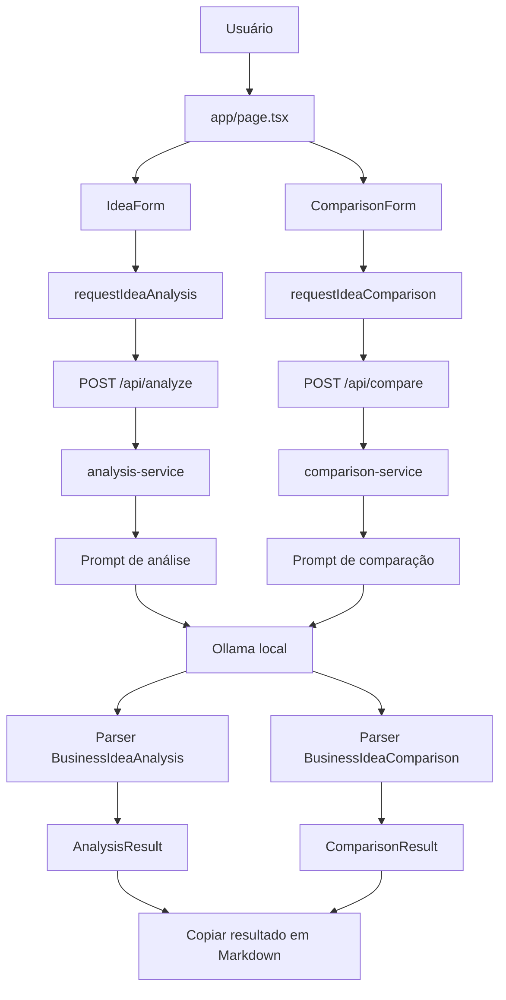

# IdeaCheck AI

## Visão geral
O IdeaCheck AI é uma aplicação web local para análise inicial de ideias de negócio com apoio de IA via Ollama.

O produto ajuda pessoas em fase inicial de criação de negócios a organizar uma ideia, entender o problema resolvido, identificar público-alvo, levantar riscos e comparar alternativas antes de avançar para validações reais de mercado.

## Funcionalidades
- Análise individual de uma ideia de negócio.
- Comparação entre duas ideias de negócio, com recomendação estruturada.
- Cópia do resultado em Markdown para análise individual e comparação.

## Tecnologias
Tecnologias confirmadas no repositório:

- Next.js 15.
- React 19.
- TypeScript.
- Tailwind CSS.
- Ollama.
- Modelo padrão `llama3.2:3b`.
- Vitest.
- React Testing Library.
- jsdom.
- Testing Library user-event.
- ESLint.
- GitHub Actions.

## Uso de IA no desenvolvimento
| etapa | uso realizado | evidência em `docs/prompts/` |
| --- | --- | --- |
| Diagnóstico arquitetural | Inspeção da arquitetura, módulos reaproveitáveis, riscos e menor evolução funcional recomendada. | [`docs/prompts/01-diagnostico-arquitetura.md`](docs/prompts/01-diagnostico-arquitetura.md) |
| Definição e refinamento de escopo | Escolha e revisão da evolução funcional, refinando a funcionalidade principal para comparação entre ideias. | [`docs/prompts/02-definicao-escopo.md`](docs/prompts/02-definicao-escopo.md) |
| Documentação de arquitetura | Registro da arquitetura, responsabilidades, fluxos e diagramas Mermaid. | [`docs/prompts/03-documentacao-arquitetura.md`](docs/prompts/03-documentacao-arquitetura.md) |
| Geração de código | Implementação inicial da comparação entre duas ideias. | [`docs/prompts/04-geracao-codigo-ciclo-1.md`](docs/prompts/04-geracao-codigo-ciclo-1.md) |
| Refinamento de interface | Ajuste de textos visíveis para reduzir detalhes técnicos na experiência do usuário. | [`docs/prompts/05-refinamento-ciclo-2.md`](docs/prompts/05-refinamento-ciclo-2.md) |
| Refinamento com Few-shot Prompting | Implementação da cópia do resultado em Markdown com exemplos orientadores. | [`docs/prompts/06-refinamento-ciclo-3.md`](docs/prompts/06-refinamento-ciclo-3.md) |
| Refatoração | Remoção de duplicação no mapeamento de recomendação para rótulo exibido e copiado. | [`docs/prompts/07-refatoracao.md`](docs/prompts/07-refatoracao.md) |
| Testes automatizados | Ampliação da cobertura para fluxos principais, entradas inválidas, casos limite, regressões e Markdown. | [`docs/prompts/08-testes.md`](docs/prompts/08-testes.md) |
| Lint | Configuração de ESLint e documentação do comando de qualidade de código. | [`docs/prompts/09-lint.md`](docs/prompts/09-lint.md) |
| Pipeline | Configuração de integração contínua com GitHub Actions. | [`docs/prompts/10-pipeline.md`](docs/prompts/10-pipeline.md) |
| Documentação e análise crítica | Registro de intervenção humana sobre sugestão insuficiente da IA. | [`docs/prompts/11-analise-critica.md`](docs/prompts/11-analise-critica.md) |
| README | Consolidação da documentação técnica e funcional do projeto. | [`docs/prompts/12-readme.md`](docs/prompts/12-readme.md) |

## Padrões de prompting aplicados
**Role-based Prompting:** os prompts definem papéis especializados, como arquiteto de software, product engineer, desenvolvedor frontend, especialista em testes, qualidade de código, CI e documentação. Isso aparece nos registros em [`docs/prompts/01-diagnostico-arquitetura.md`](docs/prompts/01-diagnostico-arquitetura.md), [`docs/prompts/02-definicao-escopo.md`](docs/prompts/02-definicao-escopo.md), [`docs/prompts/04-geracao-codigo-ciclo-1.md`](docs/prompts/04-geracao-codigo-ciclo-1.md) e demais prompts.

**Few-shot Prompting:** o ciclo 3 usou exemplos de análise individual, comparação de ideias e ausência de resultado para orientar a implementação da cópia em Markdown. A evidência está em [`docs/prompts/06-refinamento-ciclo-3.md`](docs/prompts/06-refinamento-ciclo-3.md).

## Arquitetura
A aplicação usa Next.js App Router para combinar a interface React e rotas locais de API no mesmo projeto. O navegador não chama o Ollama diretamente: a interface chama rotas internas, as rotas validam a entrada, os serviços montam prompts, a integração com Ollama gera o texto e os parsers transformam a resposta em estruturas TypeScript exibidas pela UI.



## Pré-requisitos
- Node.js compatível com Next.js 15.
- npm.
- Ollama instalado e em execução para usar os fluxos com IA.
- Modelo `llama3.2:3b` disponível no Ollama, salvo uso de outro modelo via `OLLAMA_MODEL`.

## Instalação
Instale as dependências:

```bash
npm install
```

Inicie o Ollama em um terminal separado:

```bash
ollama serve
```

Baixe o modelo padrão:

```bash
ollama pull llama3.2:3b
```

Opcionalmente, defina outro modelo compatível:

```bash
OLLAMA_MODEL=llama3.2:3b npm run dev
```

## Execução
Inicie a aplicação:

```bash
npm run dev
```

Acesse no navegador:

```text
http://localhost:3000
```

## Qualidade de código
Execute as validações locais:

```bash
npm run lint
npm test
npm run build
```

Também existe modo de observação para testes:

```bash
npm run test:watch
```

No estado atual, não há script de cobertura configurado no `package.json`.

## Integração contínua
O workflow [`.github/workflows/ci.yml`](.github/workflows/ci.yml) executa automaticamente em `push` e `pull_request`.

O pipeline:
- faz checkout do repositório;
- configura Node.js 22;
- habilita cache npm;
- instala dependências com `npm ci`;
- executa `npm run lint`;
- executa `npm test`;
- executa `npm run build`.

## Cenários de uso

### Cenário 1 — análise individual
- Contexto: o usuário quer avaliar uma única ideia de negócio.
- Exemplo de entrada: `Aplicativo para pequenos restaurantes preverem demanda e reduzirem desperdício.`
- Ação: preencher o campo de ideia e solicitar a análise.
- Resultado esperado: a aplicação retorna uma análise estruturada com problema resolvido, público-alvo, concorrência básica, pontos de atenção, próximos passos sugeridos e nota inicial de viabilidade.

### Cenário 2 — comparação de ideias
- Contexto: o usuário tem duas alternativas e quer decidir qual investigar primeiro.
- Exemplo de entrada A: `Aplicativo para pequenos restaurantes preverem demanda e reduzirem desperdício.`
- Exemplo de entrada B: `Plataforma para conectar produtores locais a consumidores do bairro.`
- Ação: preencher as duas ideias e solicitar a comparação.
- Resultado esperado: a aplicação retorna resumo comparativo, ideia recomendada, justificativa, vantagens de cada ideia, riscos de cada ideia, diferenças de público-alvo, próximos passos e critérios comparativos.

## Refatoração documentada
A refatoração documentada removeu duplicação no mapeamento de `recommendedIdea` para os rótulos `Ideia A`, `Ideia B` e `Empate`. Antes, o mesmo mapeamento existia na UI e na conversão para Markdown. Depois, a regra passou a ficar centralizada em `lib/recommended-idea-label.ts`.

Detalhes: [`docs/REFATORACAO.md`](docs/REFATORACAO.md).

## Análise crítica de saída da IA
Durante a definição de escopo, a IA sugeriu “Copiar a análise em Markdown” como principal evolução funcional. A revisão humana identificou que a ideia era útil, mas insuficiente como funcionalidade principal por não adicionar lógica de negócio relevante.

O escopo foi refinado para priorizar a comparação entre duas ideias com recomendação estruturada. A cópia em Markdown foi preservada depois como melhoria secundária.

Detalhes: [`docs/ANALISE-CRITICA.md`](docs/ANALISE-CRITICA.md).

## Limitações
- O uso funcional da IA depende do Ollama instalado e em execução localmente.
- O modelo `llama3.2:3b` precisa estar disponível, salvo configuração alternativa via `OLLAMA_MODEL`.
- O tempo de resposta depende do hardware local e do carregamento do modelo.
- A resposta da IA pode ser incompleta, genérica ou imprecisa.
- A aplicação não realiza pesquisa real de mercado.
- A análise e a recomendação não substituem validação com usuários, clientes ou especialistas.
- Não há autenticação, banco de dados, histórico ou dashboard.
- Não há deploy configurado.
- Não há script de cobertura de testes configurado.

## Melhorias futuras
- Histórico local de ideias analisadas.
- Download do resultado em arquivo.
- Comparação entre mais de duas ideias.
- Campos guiados para problema, público, solução e diferenciais.
- Configuração de modelo pela interface.
- Validação mais robusta da estrutura retornada pela IA.
- Streaming da resposta.
- Script de cobertura de testes.
- Análises adicionais, como proposta de valor, monetização, canais e hipóteses críticas.

## Documentação complementar
- [`docs/ESCOPO.md`](docs/ESCOPO.md)
- [`docs/ARQUITETURA-M1S08.md`](docs/ARQUITETURA-M1S08.md)
- [`docs/REFATORACAO.md`](docs/REFATORACAO.md)
- [`docs/ANALISE-CRITICA.md`](docs/ANALISE-CRITICA.md)
- [`docs/prompts/README.md`](docs/prompts/README.md)
- [`docs/prompts/01-diagnostico-arquitetura.md`](docs/prompts/01-diagnostico-arquitetura.md)
- [`docs/prompts/02-definicao-escopo.md`](docs/prompts/02-definicao-escopo.md)
- [`docs/prompts/03-documentacao-arquitetura.md`](docs/prompts/03-documentacao-arquitetura.md)
- [`docs/prompts/04-geracao-codigo-ciclo-1.md`](docs/prompts/04-geracao-codigo-ciclo-1.md)
- [`docs/prompts/05-refinamento-ciclo-2.md`](docs/prompts/05-refinamento-ciclo-2.md)
- [`docs/prompts/06-refinamento-ciclo-3.md`](docs/prompts/06-refinamento-ciclo-3.md)
- [`docs/prompts/07-refatoracao.md`](docs/prompts/07-refatoracao.md)
- [`docs/prompts/08-testes.md`](docs/prompts/08-testes.md)
- [`docs/prompts/09-lint.md`](docs/prompts/09-lint.md)
- [`docs/prompts/10-pipeline.md`](docs/prompts/10-pipeline.md)
- [`docs/prompts/11-analise-critica.md`](docs/prompts/11-analise-critica.md)
- [`docs/prompts/12-readme.md`](docs/prompts/12-readme.md)
