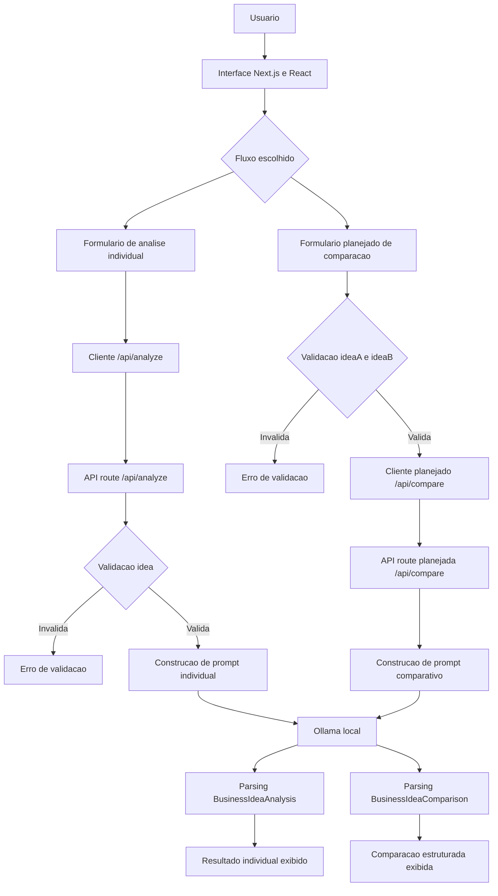
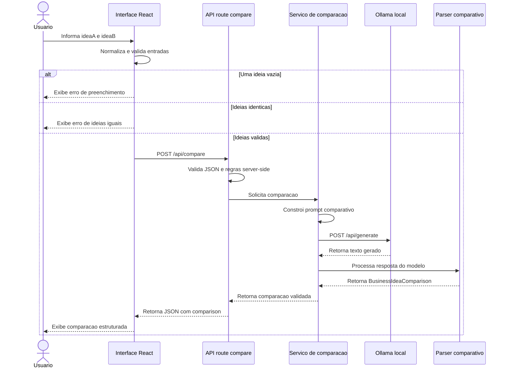

# Arquitetura do IdeaCheck AI

## 1. Visão geral
O IdeaCheck AI é uma aplicação web local para análise inicial de ideias de negócio com apoio de um modelo de linguagem executado via Ollama. A arquitetura atual usa Next.js App Router, React, TypeScript e Tailwind CSS em um único projeto, com separação clara entre interface, rota local de API, camada de serviços, integração com Ollama, parsing da resposta e tipos compartilhados.

O estado atual implementado cobre a análise individual de uma ideia por meio de `POST /api/analyze`. A evolução planejada em `docs/ESCOPO.md` adiciona uma segunda funcionalidade principal: comparar duas ideias de negócio distintas com suporte do mesmo modelo local, preservando integralmente o fluxo individual existente.

Esta documentação separa o que existe hoje do que está planejado. Não há, no estado atual do repositório, rota `/api/compare`, componentes de comparação, tipos de comparação ou parser de comparação; esses itens são planejados como hipóteses de implementação baseadas no escopo aprovado.

## 2. Arquitetura atual
A arquitetura atual é um monólito local com frontend e backend leve no mesmo projeto Next.js.

Componentes existentes:

- `app/page.tsx`: compõe a tela principal, texto introdutório e `IdeaForm`.
- `app/layout.tsx`: define metadados, idioma `pt-BR` e estrutura raiz.
- `app/api/analyze/route.ts`: recebe `POST /api/analyze`, valida JSON e entrada, chama a análise e traduz erros em respostas HTTP.
- `components/IdeaForm.tsx`: gerencia estado do formulário, validação client-side, chamada à API, mensagens e resultado.
- `components/IdeaTextarea.tsx`: campo controlado para entrada da ideia.
- `components/FormStatusMessage.tsx`: mensagem visual para estados de erro, carregamento e sucesso.
- `components/AnalysisResult.tsx`: exibe as seis seções da análise individual.
- `lib/api.ts`: cliente browser para `/api/analyze` e validação runtime da resposta.
- `lib/analysis-service.ts`: orquestra prompt, chamada ao Ollama, parsing e validação mínima da análise.
- `lib/analysis.ts`: converte texto gerado pelo LLM em `BusinessIdeaAnalysis` usando aliases de seções.
- `lib/ollama.ts`: encapsula `fetch` para `http://localhost:11434/api/generate`, modelo padrão e erros de integração.
- `lib/prompts.ts`: constrói o prompt da análise individual.
- `lib/messages.ts`: centraliza mensagens de UI e API.
- `lib/validation.ts`: normaliza entrada textual com `trim`.
- `types/analyze.ts`, `types/ollama.ts`, `types/ui.ts`: contratos TypeScript atuais.
- `tests/`: cobre parte do comportamento do formulário e da rota de análise.

A interface não chama o Ollama diretamente. O navegador fala com uma rota local do Next.js, e a rota server-side concentra a integração com o modelo local.

## 3. Fluxo atual — análise individual
1. O usuário acessa a página inicial.
2. `app/page.tsx` renderiza `IdeaForm`.
3. O usuário digita uma ideia no `IdeaTextarea`.
4. `IdeaForm` normaliza a entrada com `normalizeIdeaInput`.
5. Se a ideia estiver vazia após `trim`, o frontend bloqueia o envio e exibe `uiMessages.emptyIdea`.
6. Se a ideia estiver preenchida, o frontend entra em estado `loading` e chama `requestIdeaAnalysis`.
7. `requestIdeaAnalysis` envia `POST /api/analyze` com `{ idea }`.
8. `app/api/analyze/route.ts` tenta ler o JSON da requisição.
9. JSON inválido retorna `400` com `apiMessages.invalidJson`.
10. Entrada ausente ou vazia retorna `400` com `apiMessages.emptyIdea`.
11. Entrada válida segue para `analyzeBusinessIdea`.
12. `buildIdeaAnalysisPrompt` cria o prompt em português.
13. `generateTextWithOllama` envia o prompt ao Ollama local com `stream: false`.
14. `parseBusinessIdeaAnalysis` transforma o texto gerado em campos estruturados.
15. `hasRequiredAnalysisSections` exige ao menos problema, público-alvo, concorrência básica e pontos de atenção.
16. A API retorna `{ analysis }`.
17. `lib/api.ts` valida se todos os campos esperados existem como string.
18. `AnalysisResult` exibe as seções para o usuário.

## 4. Evolução planejada — comparação de ideias
A evolução planejada adiciona comparação entre duas ideias distintas. Ela deve receber `ideaA` e `ideaB`, validar que ambas foram preenchidas, impedir comparação de textos idênticos após normalização e reutilizar a integração existente com o Ollama local.

Responsabilidades planejadas:

- Criar uma rota local, provavelmente `app/api/compare/route.ts`, para isolar a comparação no servidor.
- Criar um cliente browser para essa rota, provavelmente em `lib/api.ts` ou arquivo equivalente.
- Criar um prompt comparativo em `lib/prompts.ts`, separado do prompt de análise individual.
- Criar uma camada de serviço, provavelmente `lib/comparison-service.ts`, reutilizando `generateTextWithOllama`.
- Criar parser e validação de resposta comparativa, provavelmente em `lib/comparison.ts`.
- Criar tipos explícitos para entrada e saída, provavelmente em `types/compare.ts` ou extensão de `types/analyze.ts`.
- Criar componentes de interface para comparação, provavelmente `ComparisonForm` e `ComparisonResult`.

Esses nomes são planejados, não existentes no repositório atual. A implementação deve preservar `/api/analyze`, `IdeaForm` e `AnalysisResult`.

## 5. Fluxo planejado — comparação de duas ideias
1. O usuário acessa a tela e escolhe o fluxo de comparação.
2. A interface exibe dois campos de ideia, reaproveitando o padrão visual de `IdeaTextarea` quando viável.
3. O usuário informa `ideaA` e `ideaB`.
4. O frontend normaliza ambas as entradas.
5. Se uma ideia estiver vazia, o frontend bloqueia o envio e exibe mensagem de validação.
6. Se as ideias forem idênticas após normalização, o frontend bloqueia o envio e informa que elas devem ser diferentes.
7. Se as entradas forem válidas, o frontend envia `POST /api/compare` com `{ ideaA, ideaB }`.
8. A rota server-side valida JSON, preenchimento e diferença entre ideias.
9. A camada de serviço monta um prompt comparativo.
10. A integração com Ollama gera a resposta com o modelo local configurado.
11. O parser planejado transforma a resposta em `BusinessIdeaComparison`.
12. A validação server-side rejeita resposta incompleta ou recomendação fora do contrato.
13. A API retorna `{ comparison }`.
14. A interface exibe resumo comparativo, ideia recomendada, justificativa, vantagens, riscos, diferenças de público-alvo, próximos passos e notas ou critérios comparativos.

## 6. Componentes e responsabilidades
| Componente ou diretório | Responsabilidade atual | Responsabilidade planejada | Observações |
| --- | --- | --- | --- |
| `app/page.tsx` | Renderiza apresentação e análise individual | Integrar acesso ao fluxo de comparação sem remover análise individual | A forma visual exata é hipótese de implementação. |
| `app/api/analyze/route.ts` | Processa análise individual | Sem mudança funcional planejada | Deve preservar contrato atual. |
| `app/api/compare/route.ts` | Não existe | Processar comparação de duas ideias | Planejado em `docs/ESCOPO.md`. |
| `components/IdeaForm.tsx` | Formulário da análise individual | Deve permanecer focado na análise individual | Evita componente grande com dois fluxos misturados. |
| `components/IdeaTextarea.tsx` | Campo controlado para uma ideia | Pode ser reaproveitado para `ideaA` e `ideaB` | Hoje usa `id` fixo `idea`; pode precisar parametrização futura. |
| `components/AnalysisResult.tsx` | Renderiza análise individual | Sem mudança obrigatória | Comparação deve ter componente próprio. |
| `components/ComparisonForm.tsx` | Não existe | Gerenciar entradas, validações e chamada de comparação | Planejado. |
| `components/ComparisonResult.tsx` | Não existe | Renderizar saída estruturada da comparação | Planejado. |
| `lib/api.ts` | Cliente browser para `/api/analyze` | Adicionar cliente para `/api/compare` ou delegar a módulo específico | Deve manter validação runtime de payload. |
| `lib/analysis-service.ts` | Orquestra análise individual | Sem mudança obrigatória | Serve como padrão para comparação. |
| `lib/comparison-service.ts` | Não existe | Orquestrar prompt, Ollama, parsing e validação comparativa | Planejado. |
| `lib/analysis.ts` | Parser e validação da análise individual | Sem mudança obrigatória | Parser comparativo deve ser separado. |
| `lib/comparison.ts` | Não existe | Parser e validação de `BusinessIdeaComparison` | Planejado. |
| `lib/ollama.ts` | Integração com Ollama local | Reutilizada pela comparação | Evita duplicar chamada ao modelo. |
| `lib/prompts.ts` | Prompt da análise individual | Adicionar prompt de comparação | Separar builders por fluxo. |
| `lib/messages.ts` | Mensagens de UI e API para análise | Adicionar mensagens específicas de comparação | Mantém padrão de centralização. |
| `lib/validation.ts` | Normaliza uma entrada | Reaproveitar normalização e adicionar validação de par de ideias se necessário | Deve evitar duplicação de regra de `trim`. |
| `types/analyze.ts` | Contratos de análise individual | Permanecer estável | Não forçar comparação dentro do contrato atual. |
| `types/compare.ts` | Não existe | Contratos da comparação | Alternativa: adicionar ao arquivo existente, mas separar reduz acoplamento. |
| `tests/app/analyze-route.test.ts` | Cobre erro 400 e 503 da análise | Manter e ampliar cobertura do fluxo atual | Há lacunas de sucesso e JSON inválido. |
| `tests/components/IdeaForm.test.tsx` | Cobre UI principal de análise | Manter como proteção contra regressão | Comparação deve ter testes próprios. |

## 7. Contratos de entrada e saída

### 7.1. Análise individual
Entrada atual:

```json
{
  "idea": "Texto livre descrevendo uma ideia de negócio"
}
```

Validações atuais:

- A requisição deve conter JSON válido.
- `idea` deve ser string preenchida após `trim`.
- A validação ocorre no frontend e novamente em `/api/analyze`.

Saída estruturada atual:

```ts
interface BusinessIdeaAnalysis {
  problemResolved: string;
  targetAudience: string;
  basicCompetition: string;
  attentionPoints: string;
  nextSteps: string;
  viabilityScore: string;
  rawText: string;
}
```

Resposta de sucesso:

```json
{
  "analysis": {
    "problemResolved": "string",
    "targetAudience": "string",
    "basicCompetition": "string",
    "attentionPoints": "string",
    "nextSteps": "string",
    "viabilityScore": "string",
    "rawText": "string"
  }
}
```

Erros esperados:

- `400`: JSON inválido.
- `400`: `idea` ausente ou vazia.
- `503`: Ollama indisponível ou modelo indisponível.
- `500`: resposta inesperada do Ollama ou análise fora da estrutura mínima.
- `500`: falha genérica não classificada.

### 7.2. Comparação de ideias
Entrada planejada:

```json
{
  "ideaA": "Texto da primeira ideia",
  "ideaB": "Texto da segunda ideia"
}
```

Validações planejadas:

- A requisição deve conter JSON válido.
- `ideaA` deve ser string preenchida após `trim`.
- `ideaB` deve ser string preenchida após `trim`.
- `ideaA` e `ideaB` devem ser diferentes após normalização.
- Entradas inválidas não devem chamar o Ollama.
- A validação deve ocorrer no frontend e na rota server-side planejada.

Saída estruturada planejada:

```ts
interface BusinessIdeaComparison {
  comparativeSummary: string;
  recommendedIdea: "ideaA" | "ideaB" | "tie";
  recommendationJustification: string;
  ideaAAdvantages: string;
  ideaBAdvantages: string;
  ideaARisks: string;
  ideaBRisks: string;
  targetAudienceDifferences: string;
  nextSteps: string;
  comparativeScores: string;
  rawText: string;
}
```

Resposta de sucesso planejada:

```json
{
  "comparison": {
    "comparativeSummary": "string",
    "recommendedIdea": "ideaA",
    "recommendationJustification": "string",
    "ideaAAdvantages": "string",
    "ideaBAdvantages": "string",
    "ideaARisks": "string",
    "ideaBRisks": "string",
    "targetAudienceDifferences": "string",
    "nextSteps": "string",
    "comparativeScores": "string",
    "rawText": "string"
  }
}
```

Erros esperados:

- `400`: JSON inválido.
- `400`: uma ou duas ideias vazias.
- `400`: ideias idênticas após normalização.
- `503`: Ollama indisponível ou modelo indisponível.
- `500`: resposta inesperada do Ollama ou comparação fora da estrutura mínima.
- `500`: falha genérica não classificada.

## 8. Diagrama de arquitetura


## 9. Diagrama de sequência


## 10. Decisões técnicas
| Decisão | Justificativa | Benefício | Trade-off | Alternativa descartada |
| --- | --- | --- | --- | --- |
| Preservar `/api/analyze` | O fluxo individual está implementado e testado parcialmente | Reduz regressão e mantém contrato atual | Mantém dois fluxos de API quando a comparação for criada | Substituir análise por um endpoint genérico |
| Criar fluxo separado para comparação | Comparação tem entrada, validações e saída próprias | Contrato mais claro e testável | Mais arquivos planejados | Reusar `/api/analyze` com modo interno |
| Reutilizar `generateTextWithOllama` | A integração local já encapsula modelo, endpoint e erros | Evita duplicação e mantém arquitetura simples | Continua herdando limitações atuais, como ausência de timeout | Criar novo cliente Ollama para comparação |
| Usar prompt comparativo separado | A comparação exige instruções e seções diferentes da análise individual | Melhora controle da resposta do modelo | Mais um prompt para manter | Adaptar o prompt individual com condicionais |
| Definir `BusinessIdeaComparison` explícito | Saída precisa ser estruturada e validável | Facilita testes e renderização | Exige parser e validação próprios | Exibir texto bruto do LLM |
| Bloquear ideias idênticas antes do Ollama | Evita gasto local e comparação sem valor | Melhora feedback e reduz chamadas desnecessárias | Não detecta ideias semanticamente quase iguais | Permitir qualquer par de textos |
| Manter execução local com Ollama | O produto depende de IA local e sem APIs externas obrigatórias | Preserva privacidade relativa e baixo custo operacional | Depende de instalação e hardware local | Usar API externa de LLM |
| Não adicionar banco de dados | O escopo não exige histórico | Menor complexidade e menos superfície de privacidade | Sem persistência de resultados | Criar histórico local ou remoto |
| Não priorizar copiar Markdown | A comparação é a evolução funcional principal | Mantém foco em lógica de negócio real | A experiência de reaproveitamento continua manual | Implementar exportação antes da comparação |

## 11. Estratégia de testes
Testes para preservar o fluxo atual:

- Manter testes de `IdeaForm` para renderização, validação de ideia vazia, loading, chamada a `/api/analyze` com entrada normalizada e exibição da análise.
- Adicionar teste de sucesso da rota `POST /api/analyze` com resposta estruturada válida.
- Adicionar teste de JSON inválido em `POST /api/analyze`.
- Adicionar teste de resposta incompleta do modelo resultando em `500`.

Testes para a evolução planejada:

- Componente de comparação bloqueia envio quando `ideaA` está vazia.
- Componente de comparação bloqueia envio quando `ideaB` está vazia.
- Componente de comparação bloqueia envio quando as ideias são idênticas após normalização.
- Componente de comparação envia `ideaA` e `ideaB` normalizadas quando válidas.
- Componente de comparação exibe resumo, recomendação, justificativa, vantagens, riscos, diferenças de público-alvo, próximos passos e notas.
- Rota `POST /api/compare` retorna `400` para ideias vazias.
- Rota `POST /api/compare` retorna `400` para ideias idênticas.
- Rota `POST /api/compare` retorna `503` quando `generateTextWithOllama` lança `OllamaUnavailableError`.
- Rota `POST /api/compare` retorna `500` quando a resposta comparativa está fora do formato mínimo.
- Parser comparativo converte resposta válida em `BusinessIdeaComparison`.
- Parser comparativo rejeita ou normaliza recomendação fora de `ideaA`, `ideaB` ou `tie`.

## 12. Riscos e mitigação
| Risco | Impacto | Mitigação |
| --- | --- | --- |
| Parser textual continuar frágil | Respostas úteis podem ser rejeitadas ou respostas incompletas podem passar | Prompt com seções fixas, aliases controlados e testes com amostras reais. |
| Comparação aumentar complexidade da UI | Usuário pode confundir análise individual e comparação | Separar os fluxos visualmente com estrutura simples, sem interface avançada. |
| Duplicação entre análise e comparação | Manutenção mais difícil se padrões divergirem | Reutilizar `generateTextWithOllama`, validação comum e mensagens centralizadas. |
| Ollama indisponível | Fluxos de análise e comparação falham | Manter tratamento `503` e mensagens claras sobre serviço/modelo local. |
| Ausência de timeout | Usuário pode ficar aguardando indefinidamente em chamadas lentas | Registrar como risco técnico; implementar timeout em etapa própria se priorizado. |
| Recomendação parecer verdade definitiva | Usuário pode superestimar a comparação | Exibir riscos, justificativa e próximos passos; manter linguagem de apoio exploratório. |
| Ideias quase iguais passarem validação | Comparação pode ter baixo valor | Nesta evolução, bloquear apenas igualdade normalizada; validação semântica fica fora do escopo. |
| Contratos planejados ainda não existem | Implementação futura pode divergir do documento | Usar este documento como referência e registrar desvios em revisão posterior. |

## 13. Limites arquiteturais
Esta evolução não inclui:

- Persistência em banco de dados.
- Autenticação.
- Histórico de análises.
- Deploy.
- Compartilhamento por link.
- Integrações externas adicionais.
- Interface avançada.
- Geração de relatórios complexos.
- Ranking de mais de duas ideias.
- Comparação em lote.
- Pesquisa real de mercado.
- Configuração de modelo pela interface.
- Streaming de resposta.
- Timeout de Ollama como parte obrigatória desta evolução.
- Migração obrigatória para JSON estruturado vindo do LLM.
- Substituição do fluxo de análise individual.
- Copiar análise em Markdown como funcionalidade principal.

## 14. Referências
- `docs/prompts/01-diagnostico-arquitetura.md`
- `docs/prompts/02-definicao-escopo.md`
- `docs/ESCOPO.md`
