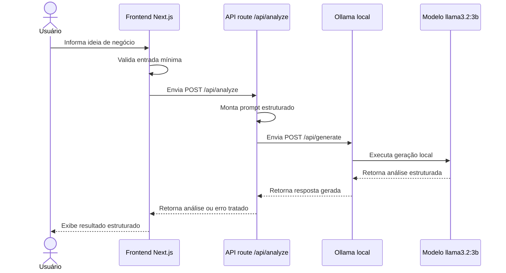
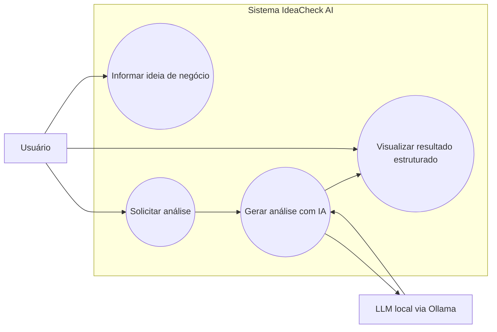

# Arquitetura - IdeaCheck AI

**Status:** Planejamento técnico inicial  
**Data:** 2026-05-28  
**Base de referência:** `docs/PRD.md`

## 1. Visão Geral da Arquitetura

O IdeaCheck AI será uma aplicação web executada localmente, planejada com Next.js, TypeScript e Tailwind CSS. A arquitetura proposta separa a interface do usuário da integração com IA por meio de uma rota local de API, evitando que o frontend chame o Ollama diretamente.

A aplicação deverá funcionar como um fluxo simples de entrada, processamento e exibição:

1. O usuário informa uma ideia de negócio na interface.
2. O frontend valida a entrada mínima.
3. O frontend envia a ideia para a rota local `/api/analyze`.
4. A rota local monta o prompt de análise.
5. A rota local chama o Ollama em `http://localhost:11434/api/generate`.
6. O modelo local `llama3.2:3b` gera uma análise estruturada.
7. A API route retorna a resposta ao frontend.
8. O frontend exibe o resultado em seções organizadas.

Essa arquitetura mantém a IA como componente funcional do produto, mas preserva a responsabilidade da aplicação por validação, tratamento de erro e apresentação da resposta.

## 2. Principais Componentes do Sistema

| Componente | Descrição |
| --- | --- |
| Usuário | Pessoa que informa uma ideia de negócio e consome a análise estruturada. |
| Frontend Next.js | Camada de interface responsável por capturar a ideia, validar a entrada, enviar a solicitação e exibir estados de carregamento, erro e sucesso. |
| Estilização com Tailwind CSS | Camada visual planejada para construir uma interface responsiva, clara e objetiva. |
| API route local `/api/analyze` | Rota de servidor planejada para receber a ideia do frontend, montar o prompt e intermediar a chamada ao Ollama. |
| Prompt de análise | Instrução estruturada enviada ao LLM para orientar formato, idioma e escopo da resposta. |
| Ollama local | Serviço local responsável por executar o modelo de linguagem no ambiente do usuário. |
| Modelo `llama3.2:3b` | Modelo sugerido para gerar a análise textual estruturada. |
| Renderizador de resultado | Parte da interface responsável por apresentar a análise em seções: problema, público-alvo, concorrência básica e pontos de atenção. |

## 3. Responsabilidade de Cada Componente

### Usuário

- Acessar a aplicação localmente.
- Informar uma ideia de negócio em linguagem natural.
- Solicitar a análise da ideia.
- Interpretar o resultado como apoio exploratório, não como validação definitiva de mercado.

### Frontend

- Exibir o formulário principal da aplicação.
- Validar se a ideia foi preenchida antes do envio.
- Enviar requisição para `/api/analyze`.
- Exibir estado de carregamento enquanto a análise é processada.
- Exibir a análise estruturada quando a resposta for bem-sucedida.
- Exibir mensagens claras em caso de erro ou entrada inválida.

### API Route Local

- Receber a ideia enviada pelo frontend.
- Validar novamente a presença da entrada no lado servidor.
- Montar o prompt final para o LLM.
- Chamar o endpoint local do Ollama.
- Tratar falhas de conexão, indisponibilidade do modelo ou resposta inesperada.
- Retornar ao frontend uma resposta adequada para sucesso ou erro.

### Ollama

- Executar localmente o modelo de linguagem configurado.
- Receber o prompt enviado pela API route.
- Gerar texto de análise conforme as instruções recebidas.
- Retornar a resposta ao servidor local da aplicação.

### Modelo de Linguagem Local

- Interpretar a ideia de negócio.
- Gerar análise em português.
- Organizar a resposta nas seções esperadas pelo produto.
- Apoiar a identificação inicial de problema, público-alvo, concorrência e pontos de atenção.

## 4. Fluxo de Comunicação Entre Frontend, API Route Local e Ollama

O fluxo planejado evita acoplamento direto entre navegador e Ollama. O frontend conversa apenas com a aplicação Next.js, enquanto a rota de servidor concentra a integração com o serviço local de IA.

## 5. Diagrama UML de Casos de Uso

O diagrama abaixo representa, em Mermaid, os principais casos de uso planejados para o MVP.

## 6. Papel Funcional da IA no Produto

A IA terá papel funcional central no IdeaCheck AI. Ela será responsável por transformar uma descrição livre de ideia de negócio em uma análise estruturada com quatro blocos principais:

- Problema que a ideia resolve.
- Público-alvo.
- Concorrência básica.
- Pontos de atenção.

A aplicação deverá deixar claro, por meio do próprio comportamento e da documentação, que a resposta da IA é um apoio inicial à reflexão. A análise gerada não substitui pesquisa de mercado, entrevistas com usuários, validação comercial ou avaliação especializada.

## 7. Justificativa Técnica Pelo Uso do Ollama

O uso do Ollama é tecnicamente adequado ao projeto porque atende diretamente aos critérios de execução local e integração real com IA. Ele permite executar um LLM no ambiente do usuário sem depender de uma API externa obrigatória.

Principais justificativas:

- Permite integração real com IA local.
- Reduz dependência de serviços pagos ou credenciais externas.
- Facilita execução e avaliação do projeto em ambiente controlado.
- Mantém a arquitetura coerente com um MVP local.
- Permite uso do modelo sugerido `llama3.2:3b`.
- Simplifica a demonstração do papel funcional da IA no produto.

## 8. Benefícios da Execução Local

- Maior controle sobre o ambiente de execução.
- Ausência de necessidade de deploy para a versão inicial.
- Menor exposição de dados do usuário a serviços externos.
- Possibilidade de executar a aplicação mesmo sem conta em provedor de IA.
- Melhor alinhamento com um projeto avaliativo focado em arquitetura, documentação e integração local.
- Custo operacional reduzido para testes e demonstrações locais.

## 9. Limitações Técnicas Conhecidas

- A aplicação dependerá do Ollama instalado e em execução localmente.
- O modelo `llama3.2:3b` precisará estar disponível no ambiente do usuário.
- O tempo de resposta poderá variar conforme hardware local.
- A resposta do LLM poderá ser inconsistente ou fugir parcialmente da estrutura esperada.
- Testes automatizados da integração real com IA poderão exigir mocks ou simulações para evitar dependência de geração não determinística.
- A qualidade da análise dependerá da clareza da ideia informada pelo usuário.
- A aplicação não fará pesquisa real de mercado nesta versão.

## 10. Possíveis Melhorias Futuras

- Permitir configuração do modelo de IA por variável de ambiente ou interface administrativa.
- Validar a resposta da IA com schema estruturado antes de exibir o resultado.
- Adicionar streaming da resposta para melhorar percepção de desempenho.
- Criar camada de serviço dedicada para encapsular chamadas ao Ollama.
- Registrar versões dos prompts utilizados pela aplicação.
- Adicionar testes automatizados para sucesso, erro, validação e resposta inesperada.
- Permitir exportação da análise em Markdown ou PDF.
- Adicionar histórico local de ideias analisadas.
- Incluir campos guiados para problema, público, solução e diferenciais.
- Evoluir a análise para incluir proposta de valor, monetização, canais e hipóteses críticas.
