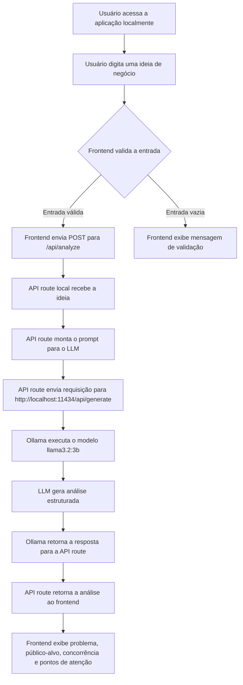
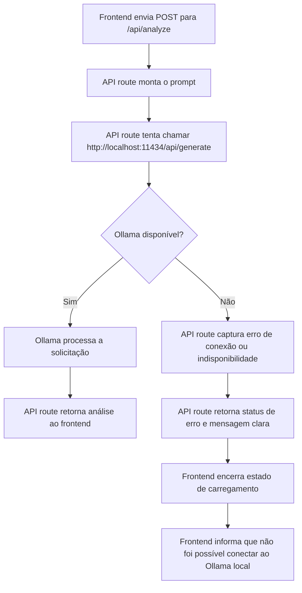
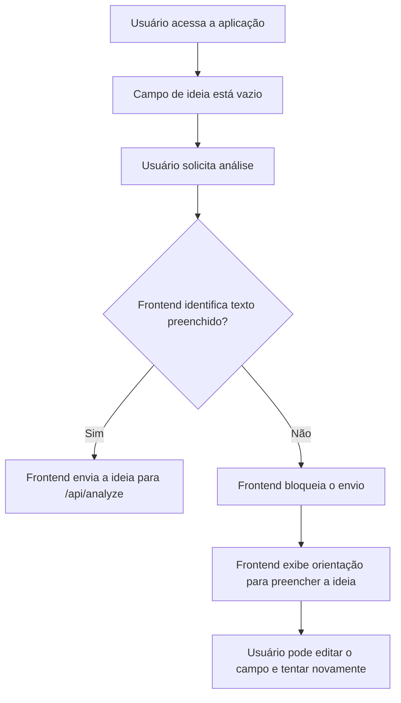

# Fluxograma de Funcionamento - IdeaCheck AI

**Status:** Planejamento técnico inicial  
**Data:** 2026-05-28  
**Base de referência:** `docs/PRD.md`

## 1. Descrição Textual do Fluxo Principal

O fluxo principal planejado para o IdeaCheck AI descreve como a ideia de negócio informada pelo usuário será enviada para análise local por IA e retornará como uma resposta estruturada.

1. Usuário acessa a aplicação localmente no navegador.
2. Usuário digita uma ideia de negócio no formulário principal.
3. Frontend valida se a entrada possui conteúdo mínimo.
4. Frontend envia a ideia para a rota local `/api/analyze`.
5. A rota local monta o prompt para o LLM com instruções de formato e idioma.
6. A rota local envia a requisição para `http://localhost:11434/api/generate`.
7. Ollama executa o modelo `llama3.2:3b` no ambiente local.
8. O LLM retorna uma análise estruturada.
9. A API route retorna a resposta ao frontend.
10. O frontend exibe a análise para o usuário em seções organizadas.

## 2. Fluxograma Principal da Aplicação

## 3. Fluxo de Erro Quando o Ollama Não Estiver Disponível

Quando o Ollama não estiver instalado, iniciado ou acessível em `http://localhost:11434`, a rota local deverá tratar a falha e retornar uma mensagem compreensível ao frontend. O usuário não deverá receber erro técnico bruto nem uma resposta parcial apresentada como análise válida.

## 4. Fluxo de Validação Para Ideia Vazia

Quando o usuário tenta solicitar análise sem preencher a ideia de negócio, o frontend deverá impedir o envio para `/api/analyze`. Essa validação reduz chamadas desnecessárias e melhora a clareza da experiência.

## 5. Observações Para a Implementação

- A rota `/api/analyze` deverá validar a entrada mesmo que o frontend já tenha feito validação inicial.
- O endpoint do Ollama planejado é `http://localhost:11434/api/generate`.
- O modelo sugerido para o MVP é `llama3.2:3b`.
- A resposta esperada deverá manter as seções definidas no PRD: problema que a ideia resolve, público-alvo, concorrência básica e pontos de atenção.
- A documentação representa o planejamento técnico da próxima etapa e não afirma que a aplicação já está implementada.
